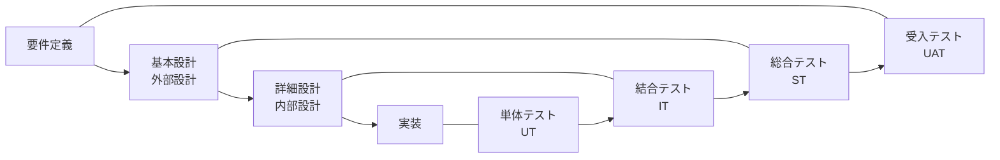
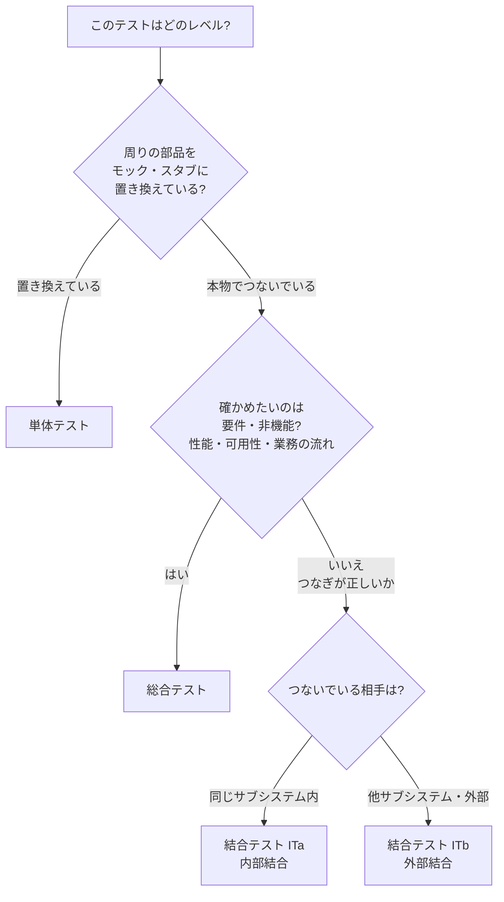

# どこまでが単体テストで、どこからが結合テスト・総合テストか

**毎回迷うところを、図と具体例だけで片付けるための資料。** 駆け出しの人に説明する前提で書いている。

---

## 0. 先に結論

> **迷う原因は、自分の理解不足ではなく「定義が1つではない」から。**
> 国際標準（JSTQB）と日本のSIer慣行で呼び方が違い、さらに**案件ごとに線引きが違う**。
> だから正解は **「その案件の試験計画書に書いてある区分」** であって、一般論ではない。

とはいえ、どの案件でも共通する**考え方の軸**が1つある。これを押さえると9割迷わなくなる。

> ### 軸: 「**本物をどこまでつないでいるか**」でレベルが決まる
>
> - 周りを**ニセモノ（スタブ・モック）に置き換えて**、1つの部品だけ動かす → **単体テスト**
> - 部品同士を**本物でつないで**動かす → **結合テスト**
> - **システム全体を本番に近い環境で**、業務の流れとして動かす → **総合テスト**

---

## 1. 全体像（V字モデル）

左側（作る工程）と右側（確かめる工程）が対になっている。**どのテストが、どの設計書を根拠に合否を判定するか**がこの図の読みどころ。



| テスト | 合否の根拠になる文書 | 「誰の言い分」を確かめているか |
|---|---|---|
| 単体（UT） | 詳細設計書 | 作った人の設計どおりか |
| 結合（IT） | 基本設計書 | 機能同士のつなぎの設計どおりか |
| 総合（ST） | 要件定義書 | システムとして要件を満たすか |
| 受入（UAT） | 業務要件・契約 | お客様の業務が回るか |

**注意**: 設計工程を何段階に分けるかで対応がずれる流派がある（基本設計＝総合テスト、とする現場もある）。これも**案件の計画書が正**。

---

## 2. 呼び方の対応表（JSTQB ↔ 日本の現場）

| JSTQB（国際標準） | 日本の現場でよく使う名前 | 略 |
|---|---|---|
| コンポーネントテスト | 単体テスト、ユニットテスト、モジュールテスト | UT |
| コンポーネント統合テスト | **内部結合テスト**、内結 | **ITa** |
| システム統合テスト | **外部結合テスト**、外結 | **ITb** |
| システムテスト | 総合テスト、システムテスト | ST |
| 受け入れテスト | 受入テスト、検収テスト | UAT |

### 結合テストが2つに割れる（ここが一番ややこしい）

結合テスト（IT）は、規模の大きい案件では ITa / ITb に分けられる。**分け方の流儀が3つあって、現場ごとに違う**。

| 流儀 | ITa（内部結合） | ITb（外部結合） |
|---|---|---|
| ① 範囲で分ける（最多） | サブシステム**内部**のモジュール同士 | サブシステム**間**・**外部システム**との連携 |
| ② 実施主体で分ける | 開発元（自分たち）が実施 | 発注元・第三者が実施 |
| ③ 環境で分ける | 開発環境で実施 | 結合試験環境・本番相当環境で実施 |

**参画したら最初に確認すること**: 「この案件のITaとITbの切り分けは、①②③のどれですか？」。これを聞くだけで、サブリーダーとして試験計画を読めるようになる。

---

## 3. 「本物をどこまでつないでいるか」で見る図

同じ `TodoService.create()` を動かしていても、**周りが本物かニセモノか**でレベルが変わる。

```
【単体テスト】 1つの部品だけ本物。周りは全部ニセモノ

    [テストコード] ──→ ■TodoService（本物）──→ □TodoRepository（モック）
                                              └─→ □（DBにはつながらない）

【結合テスト】 部品同士を本物でつなぐ。外部システムはまだニセモノのことが多い

    [テストコード] ──→ ■Controller ──→ ■Service ──→ ■Repository ──→ ■DB（本物）
                                                        └─→ □外部システム（スタブ）

【総合テスト】 全部本物。本番に近い環境で、業務の流れとして通す

    [利用者の操作] ──→ ■画面 ──→ ■AP ──→ ■DB ──→ ■外部システム（本物/連携試験用）
                   （性能・障害・運用手順も含めて確認）
```

| | 単体 | 結合 | 総合 |
|---|---|---|---|
| 動かす範囲 | クラス・メソッド1つ | 機能をまたぐ経路 | システム全体 |
| DB | 使わない（モック） | **使う**（本物のDB） | 使う（本番相当データ量） |
| 外部システム | モック | スタブ or 連携試験 | 本物 or 連携試験環境 |
| 画面 | 通さない | 通すこともある | **通す（利用者と同じ操作）** |
| 誰が見るか | 開発者 | 開発チーム | 開発チーム＋お客様 |
| 根拠 | 詳細設計書 | 基本設計書 | 要件定義書 |

---

## 4. 具体例で判定する

### 4-1. Todoアプリ（手元の教材）で考える

| 確認したいこと | レベル | 理由 |
|---|---|---|
| `TodoServiceImpl#create` が未完了5件のとき例外を投げる（Repositoryはモック） | **単体** | 1クラスだけ。周りはニセモノ |
| タイトルが未入力のとき、Formのバリデーションでエラーになる | **単体** | 入力チェック単体の確認 |
| 画面で登録ボタンを押すと、DBにレコードが1件増える | **結合** | Controller→Service→Repository→DBが本物でつながっている |
| 登録→一覧→完了→削除を続けて操作し、画面とDBが矛盾しない | **結合**（業務シナリオ寄りなら総合） | 複数機能をまたぐ。どちらに置くかは計画書次第 |
| 1万件登録された状態で一覧表示が3秒以内 | **総合** | 性能は非機能要件＝要件定義が根拠 |
| ブラウザEdgeとChromeの両方で画面が崩れない | **総合** | 動作環境の要件 |

### 4-2. 公共系の納付システム（案件に近い例）

| 確認したいこと | レベル | 理由 |
|---|---|---|
| 税額計算ロジックが、減免区分ごとに正しい金額を返す | **単体** | 計算クラス単体 |
| 納付登録画面から登録すると、納付テーブルと車両テーブルの両方が更新される | **結合（ITa）** | サブシステム内部の複数テーブル更新 |
| 納付データが夜間バッチで会計システムへ連携される | **結合（ITb）** | 外部システムとの連携 |
| 現行システムと新システムに同じデータを入れ、帳票の出力結果が一致する（現新比較） | **総合** | 移行性の要件。システム全体の出力を比較 |
| 納期限直前のピーク時、300人同時アクセスで応答3秒以内 | **総合** | 性能要件 |
| 業務担当者が1日の業務を通しで実施できる（受付→登録→照会→帳票） | **総合 or 受入** | 業務シナリオ。お客様が主体なら受入 |
| サーバ1台を落としても業務が継続できる | **総合** | 可用性要件 |

---

## 5. 迷ったときの判断フロー



**それでも迷ったら**: 「このケースの合否は、どの設計書を見れば判定できるか？」と自問する。詳細設計書で判定できるなら単体、基本設計書なら結合、要件定義書なら総合。

---

## 6. よく揉める5つのケース

| ケース | 答え | 理由 |
|---|---|---|
| **DBを使うテストは単体？結合？** | 一般には**結合**。ただし「Mapper/Repositoryだけを本物DBで確認する」ものを単体に含める案件もある | DBという別の部品と本物でつないでいるため。ただし自動テストの世界では「DBありの単体テスト」と呼ぶ流派もあり、**用語より案件の定義** |
| **モックを使えば何でも単体？** | ほぼYes。ただし**モックだらけのテストは「設計どおりに呼んだか」しか確認できない** | 本物をつないだときに壊れるバグ（SQLの誤り、トランザクション境界）は単体では見つからない |
| **画面を操作したら必ず総合？** | No。**結合でも画面は通す**（画面→DBの経路確認）。総合かどうかは「要件・業務シナリオを確かめているか」で決まる | 画面の有無はレベルの決め手ではない |
| **外部システムをスタブにしたら ITb ではない？** | 多くの案件で**ITbに含める**（相手が未完成・接続できない期間はスタブで代替し、後で本接続の試験を別途行う） | 「スタブで実施したか本接続か」を試験仕様書の備考に必ず残す |
| **性能テストは結合でやってもいい？** | 計測目的なら**総合**。ただし「明らかに遅い」を早期に見つける目的で結合中に簡易計測するのは有効 | 本番相当のデータ量・同時アクセスが用意できるのは総合の環境 |

---

## 7. 自動テストの用語と対応（混乱の元）

開発者コミュニティ（自動テスト文脈）と、SIerの工程名は**別の体系**。会話がかみ合わないときはこれが原因。

| 自動テストの呼び方 | だいたい対応する工程 | ずれるポイント |
|---|---|---|
| ユニットテスト | 単体テスト（UT） | 自動テストでは「DBあり」も単体に含めることがある |
| インテグレーションテスト | 結合テスト（ITa） | Spring の `@SpringBootTest` はこれ |
| E2Eテスト | 結合（画面経由）〜総合 | ブラウザを通すが、要件確認とは限らない |
| リグレッション（回帰）テスト | **工程ではなく目的** | どのレベルでも実施しうる。「壊れていないかの再確認」 |
| スモークテスト | **工程ではなく目的** | 最低限動くかの素早い確認。各工程の入口で行う |

**覚えておくと得なこと**: 「リグレッション」「スモーク」は**テストレベルではなくテストの種類（目的）**。「それは結合テストですか、リグレッションテストですか？」という質問は、実は噛み合っていない（結合テストとして実施するリグレッションテスト、があり得る）。

---

## 8. 確認問題

**Q1.** 「`TodoRepository` の実装クラスを、本物のPostgreSQLにつないでSQLが正しいか確認するテスト」は単体か結合か。

<details><summary>答え</summary>

**多くの案件で結合**（本物のDBとつないでいる＝「本物をどこまでつないでいるか」の軸）。ただし自動テストの世界では `@DataJpaTest` 等を「DBありの単体テスト」と呼ぶこともあり、**案件の試験計画書の定義に従う**のが正解。迷ったら計画書を見る／リーダーに聞く、が常に正しい動き。
</details>

**Q2.** 結合テストの試験仕様書をレビューしていたら、「ピーク時300人同時アクセスで3秒以内」というケースがあった。何を指摘するか。

<details><summary>答えの例</summary>

レベルの置き場所がおかしい可能性が高い（性能＝非機能要件＝総合テストの範囲）。加えて、結合テストの環境では本番相当のデータ量・同時アクセスを再現できないことが多く、**ここで測っても意味のある数字が出ない**。総合テストに移すか、結合では「明らかな遅延の早期検知」と目的を書き換えるかをリーダーに相談する。
</details>

**Q3.** 新人から「この確認、単体でやるべきか結合でやるべきか分かりません」と相談された。どう答えるか（手順で）。

<details><summary>答えの例</summary>

①「周りの部品をモックに置き換えている？本物でつないでいる？」を聞く → 置き換えているなら単体 ②本物でつないでいるなら「確かめたいのは、つなぎ方が正しいか／要件を満たすか、どっち？」を聞く → つなぎなら結合、要件なら総合 ③それでも決まらなければ「このケースの合否はどの設計書で判定できる？」を一緒に確認する ④最後は**案件の試験計画書の区分定義に当てる**。新人に「一般論の正解」を教えるのではなく、**案件の定義を見に行く習慣**を渡すのがポイント。
</details>

**Q4.** ITaとITbの違いを、2通りの流儀で説明せよ。

<details><summary>答え</summary>

①範囲で分ける流儀: ITa＝サブシステム内部のモジュール間、ITb＝サブシステム間・外部システムとの連携。②実施主体で分ける流儀: ITa＝開発元が実施、ITb＝発注元など開発元以外が実施。他に環境で分ける流儀（開発環境／結合試験環境）もある。**どれを採っているかは案件次第**。
</details>

---

## 参考記事

- [テストレベルとは？4段階の目的・対象とテストタイプとの違いを解説 — VALTES](https://service.valtes.co.jp/s-test/blog/test-level_vol94/)
- [JSTQB Foundation Level シラバス 日本語版（PDF・原典）](https://jstqb.jp/dl/JSTQB-SyllabusFoundation_VersionV40.J02.pdf) — 第2章にテストレベルの定義
- [ITa（内部結合テスト / 内結）とは — e-Words](https://e-words.jp/w/ITa.html) / [ITb（外部結合テスト / 外結）とは — e-Words](https://e-words.jp/w/ITb.html)
- [単体テスト・結合テスト・総合テストの違い、観点や注意点](https://pm-rasinban.com/ut-it-st)
- [結合テストと総合テストの違いを明確化する](https://ysinc.co.jp/blog/integration-test-system-test/)
- [V字モデルとは？開発とテストの流れ — SHIFT](https://service.shiftinc.jp/column/10905/)
- [テストのいろんな定義（WF・アジャイル・JSTQB・テストピラミッド・Google） — Qiita](https://qiita.com/yoshitaro-yoyo/items/132c6d6d144448db49e0) — 定義が流派で違うことを一覧にした記事
